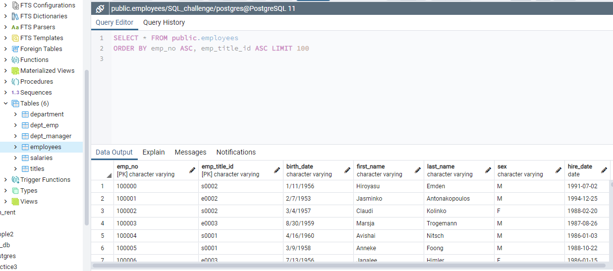
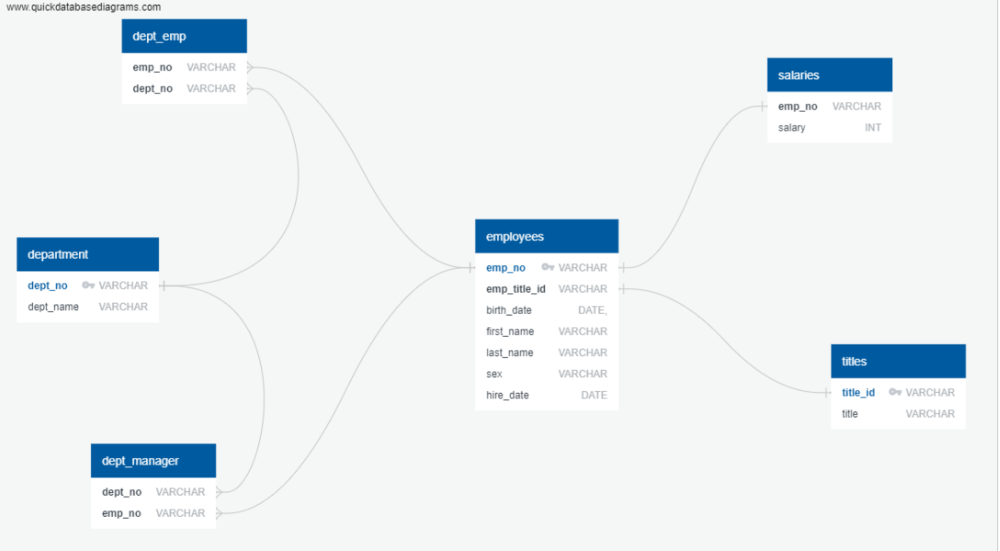
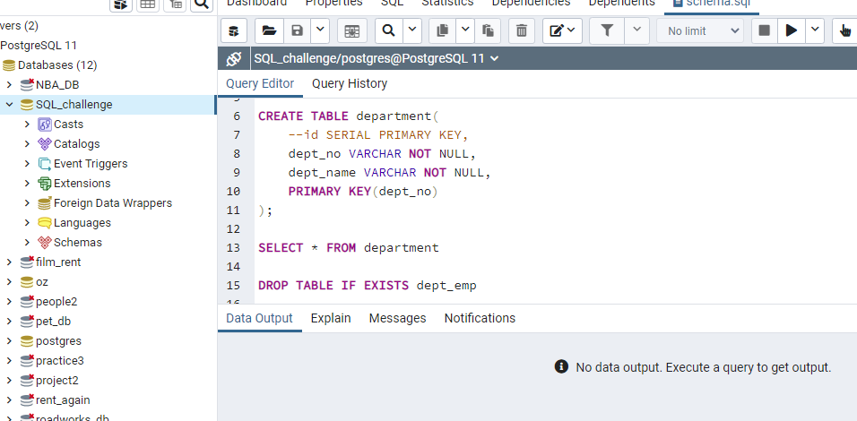
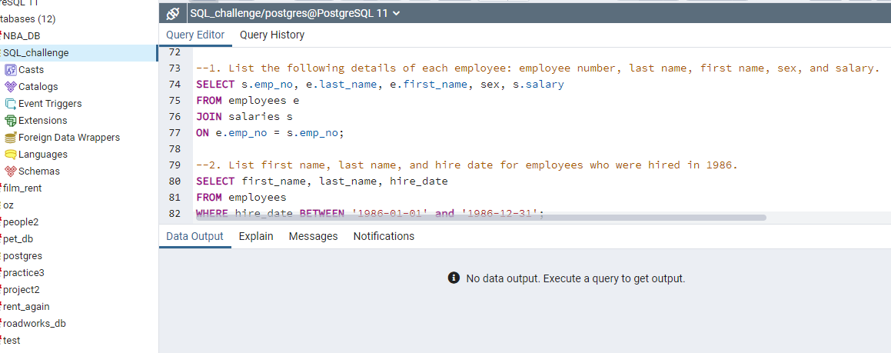
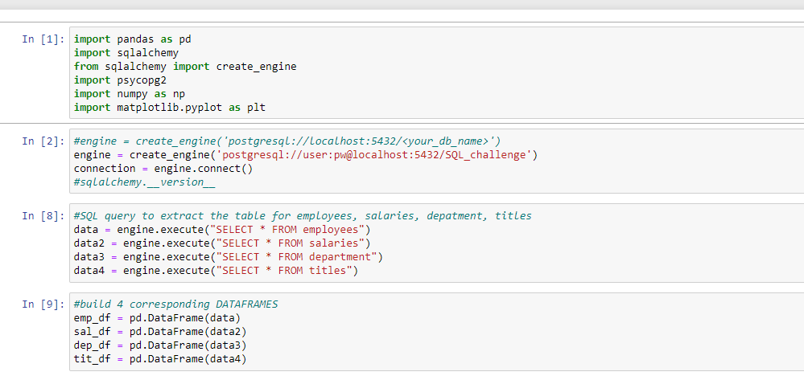

# SQL_challenge
Tony Zhao finished 15/02/2021 

## Background

The task is a research project on employees of the corporation from the 1980s and 1990s. All that remain of the database of employees from that period are six CSV files.

To design the tables to hold data in the CSVs, import the CSVs into a SQL database, and answer questions about the data. 

Perform:

1. Data Engineering

2. Data Analysis

## Job details

#### Data Modeling

Inspect the CSVs and sketch out an ERD of the table, to use a tool like [http://www.quickdatabasediagrams.com](http://www.quickdatabasediagrams.com).

#### Data Engineering

* To create a table schema for each of the six CSV files. Remember to specify data types, primary keys, foreign keys, and other constraints.

  * For the primary keys check to see if the column is unique, otherwise create a [composite key](https://en.wikipedia.org/wiki/Compound_key). Which takes to primary keys in order to uniquely identify a row.
  * Be sure to create tables in the correct order to handle foreign keys.

* Import each CSV file into the corresponding SQL table. **Note** be sure to import the data in the same order that the tables were created and account for the headers when importing to avoid errors.

#### Data Analysis

To do the following:

1. List the following details of each employee: employee number, last name, first name, sex, and salary.

2. List first name, last name, and hire date for employees who were hired in 1986.

3. List the manager of each department with the following information: department number, department name, the manager's employee number, last name, first name.

4. List the department of each employee with the following information: employee number, last name, first name, and department name.

5. List first name, last name, and sex for employees whose first name is "Hercules" and last names begin with "B."

6. List all employees in the Sales department, including their employee number, last name, first name, and department name.

7. List all employees in the Sales and Development departments, including their employee number, last name, first name, and department name.

8. In descending order, list the frequency count of employee last names, i.e., how many employees share each last name.

#### Sqlalchemy operation

1. Import the SQL database into Pandas. 
   
   
* Consult [SQLAlchemy documentation](https://docs.sqlalchemy.org/en/latest/core/engines.html#postgresql) for more information.

2. Create a histogram to visualize the most common salary ranges for employees.

3. Create a bar chart of average salary by title.

## Finally the repo included the followings:

* The image file of my ERD.

    
* The `schema.sql` file of my table schemata.

* The `employeesSQL.sql` file of my queries.

    
* The original resources files included.

* The Jupyter Notebook of the sqlalchemy analysis.

 
    Remarks: please noticed the username and password for PostgreSql are not supplied.
    
* **Job done!**
